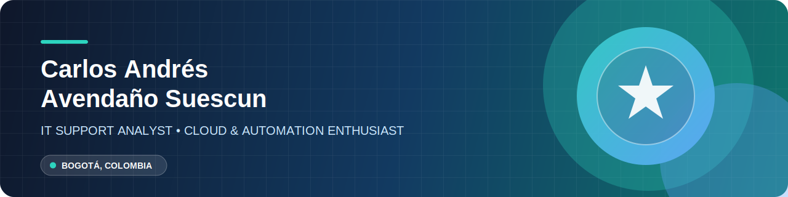

 

 

##  Perfil profesional

<table>
  <tr>
    <td width="56%" valign="top">

### Hola, soy Carlos 👋

Analista de soporte TI con enfoque en soluciones cloud, automatización y experiencias de soporte que realmente resuelven. Disfruto tomar retos técnicos, organizarlos y convertirlos en procesos claros, confiables y documentados.

**Mi objetivo:** seguir construyendo infraestructura moderna y automatizada que ayude a los equipos a trabajar mejor.

    </td>
    <td width="44%" valign="top">

### En este momento

🔵 Profundizando en **Microsoft Azure**  
🟢 Construyendo proyectos de infraestructura  
🟣 Practicando **SQL** y automatización  
🟠 Compartiendo mi progreso en GitHub

    </td>
  </tr>
</table>

## ✦ Mi stack de trabajo

 

<table>
  <tr>
    <td align="center" width="33%">☁️ <strong>Cloud</strong> Azure Fundamentals · AZ-900</td>
    <td align="center" width="33%">🛟 <strong>Soporte TI</strong> Usuarios · Sistemas · Resolución de incidentes</td>
    <td align="center" width="33%">⚙️ <strong>Automatización</strong> Procesos repetibles y documentados</td>
  </tr>
</table>

## 🚀 Proyectos seleccionados

<table>
  <tr>
    <td width="50%" valign="top">

### ☁️ Portafolio Azure Empresarial

Proyecto enfocado en demostrar soluciones de infraestructura y servicios cloud para escenarios empresariales.

**Tecnologías:** Azure · Cloud · Infraestructura  
[Explorar repositorio →](https://github.com/carlosandressuescun38-arch/portafolio-azure-empresarial)

    </td>
    <td width="50%" valign="top">

### 💼 Mi CV

Mi presentación profesional y un espacio para documentar el camino que estoy construyendo en tecnología.

**Tecnologías:** HTML · GitHub · Documentación  
[Explorar repositorio →](https://github.com/carlosandressuescun38-arch/mi-cv)

    </td>
  </tr>
</table>

## 📊 Actividad y aprendizaje

  
  

  
<strong>🎯 Ruta de aprendizaje 2026</strong>

   

  - [x] Obtener la certificación Microsoft Azure Fundamentals (AZ-900).
  - [ ] Crear proyectos reales de infraestructura en Azure.
  - [ ] Profundizar en SQL y automatización.
  - [ ] Mejorar la documentación técnica y el portafolio público.

 

### “Aprender, documentar y automatizar: pequeñas mejoras que generan grandes resultados.”

Diseñado con intención · Bogotá, Colombia 🇨🇴

<!--
ANTES DE PUBLICAR:
1. Reemplaza TU-USUARIO por tu usuario de LinkedIn.
2. Reemplaza TU--CORREO@ejemplo.com por tu correo profesional.
3. Sube también el archivo profile-banner.svg para que se vea la cabecera gráfica.
-->
